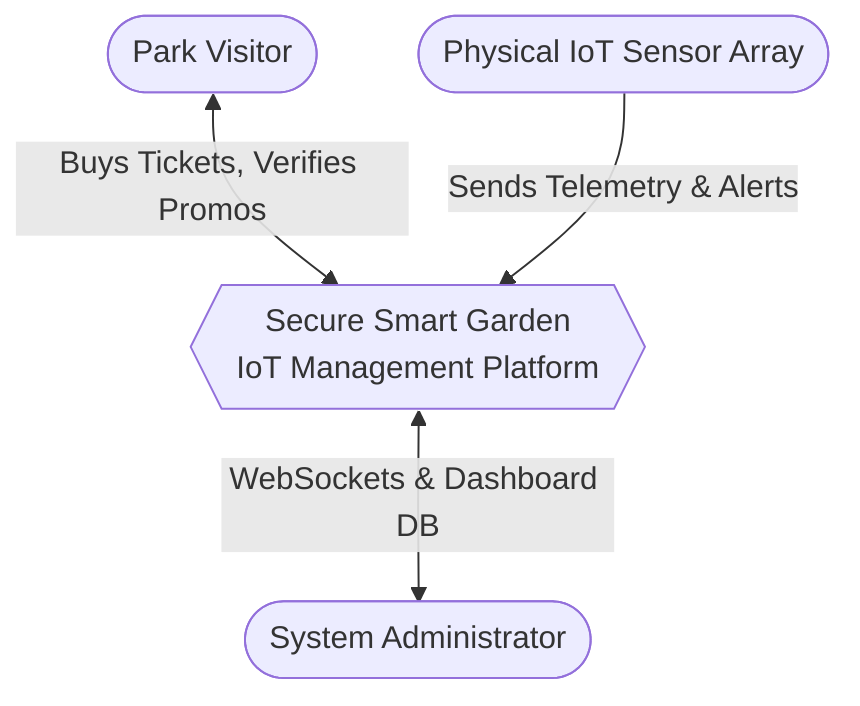
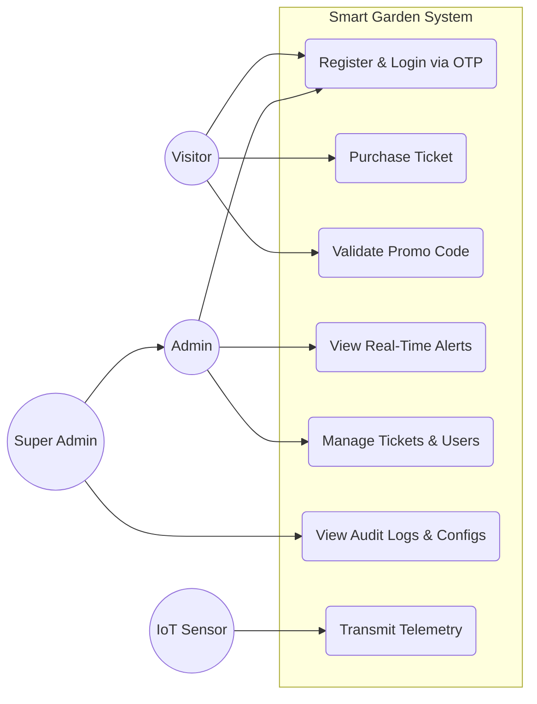
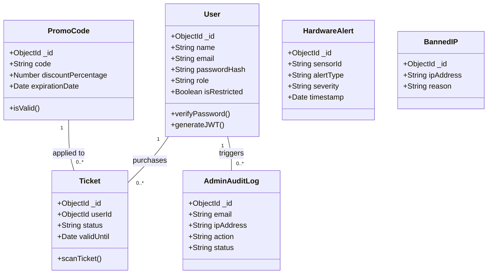
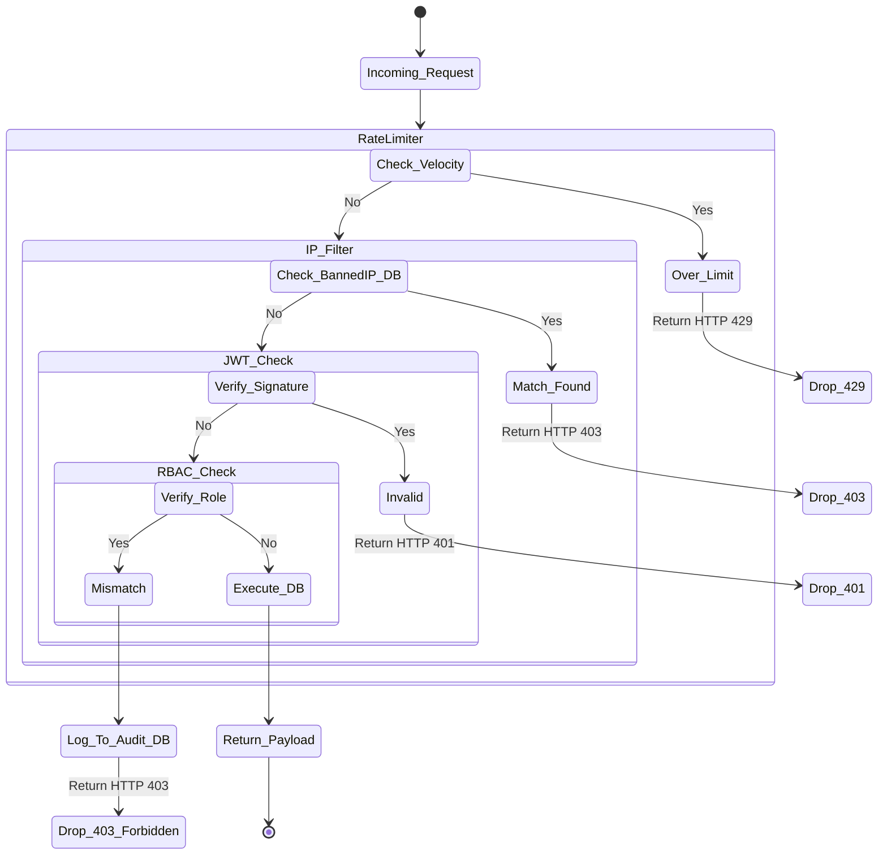
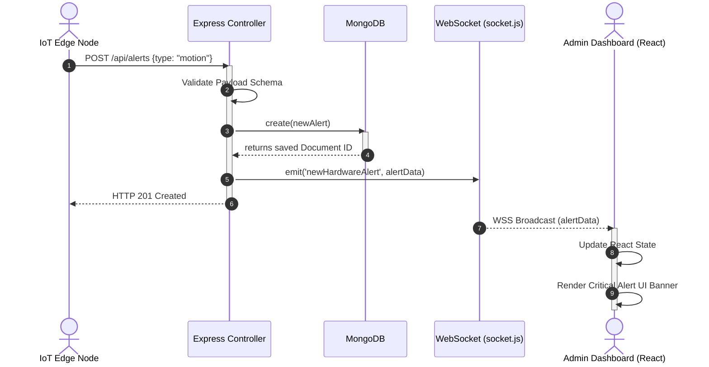

# 🛡️ Secure Smart Garden IoT Management System

[](https://nodejs.org/)
[](https://www.mongodb.com/)
[](https://reactjs.org/)
[]()

An enterprise-grade, full-stack IoT management platform designed to monitor physical park infrastructure, automate ticketing, and mitigate network-layer threats in real-time. This system enforces the **Confidentiality, Integrity, and Availability (CIA) triad** directly at the application layer using specialized middleware pipelines and stateless WebSocket telemetry broadcasting.

---

## 📑 Table of Contents
1. [System Overview](#-system-overview)
2. [System Requirements](#-system-requirements)
3. [Architectural Diagrams](#-architectural-diagrams)
4. [Security Architecture & Threat Mitigation](#-security-architecture--threat-mitigation)
5. [Core API Endpoints](#-core-api-endpoints)
6. [Deployment & Local Setup](#-deployment--local-setup)

---

## 🌐 System Overview

The platform bridges physical environmental sensors with a secure web backend, offering:
* **Real-time IoT Telemetry:** Ingests hardware alerts (gate sensors, soil moisture) and broadcasts them instantly to the admin dashboard via WebSockets.
* **Automated Ticketing Lifecycle:** Utilizes `node-cron` to automatically audit and expire out-of-date tickets, maintaining database hygiene.
* **Fault-Tolerant UI:** The React frontend implements isolated error boundaries to prevent cascading application failures if third-party modules timeout.
* **Cryptographic Identity Management:** Enforces stateless session validation using JSON Web Tokens (JWT) signed via HMAC-SHA256.

---

## 📋 System Requirements

### Functional Requirements (FRs)
* **FR1 (Authentication):** The system shall allow users to register, login securely, and verify identity using email-based One-Time Passwords (OTP).
* **FR2 (Access Control):** The system shall enforce Role-Based Access Control (RBAC), restricting routes based on User, Sub-Admin, and Super-Admin privileges.
* **FR3 (Ticketing):** Visitors shall be able to purchase tickets, and the system shall automatically process ticket lifecycles (active, scanned, expired) via cron jobs.
* **FR4 (Promotions):** Administrators shall be able to generate and validate promotional discount codes.
* **FR5 (IoT Integration):** The backend shall receive physical IoT sensor payloads and instantly broadcast critical alerts to admin dashboards via WebSockets.
* **FR6 (Security Logging):** The system shall automatically blacklist abusive IPs and generate immutable `AdminAuditLog` entries for unauthorized configuration attempts.

### Non-Functional Requirements (NFRs)
* **NFR1 (Security):** All API communications must use TLS 1.3. Sessions must be stateless (JWT), and passwords must be hashed using bcrypt/Argon2.
* **NFR2 (Resilience/Availability):** The API Gateway must implement strict rate-limiting to prevent volumetric Denial of Service (DoS) and credential stuffing.
* **NFR3 (Performance):** WebSocket state synchronization must broadcast hardware alerts to the client in under 200ms.
* **NFR4 (Maintainability):** The backend must utilize a decoupled MVC architecture to isolate security middleware from core database operations.

---

## 📊 Architectural Diagrams

### 1. Context Diagram (Level 0 DFD)
Shows the system as a single entity interacting with external actors.


### 2. Use-Case Diagram

Maps actors to their allowed capabilities within the system.



### 3. Class Diagram & Entity Relationship

Represents the structural database schema models and their relationships (Mongoose ODM).



### 4. Activity Diagram: Threat Mitigation Pipeline

Details the logical flow of a request passing through the security middleware.



### 5. Sequence Diagram: Real-Time IoT Telemetry

Outlines the chronological flow of a hardware sensor triggering a secure broadcast.



---

## 🔒 Security Architecture & Threat Mitigation

The backend is engineered with a strict **Defense-in-Depth** methodology, heavily protected by specialized middleware pipelines before any data logic is executed.

### 1. Threat Mitigation Pipeline

* **`rateLimiters.js`**: Prevents volumetric abuse. Auth endpoints are blocked after 5 failed attempts per 15-minute window (`authLimiter`). Financial/Promo endpoints are restricted to 10 attempts per hour (`promoLimiter`).
* **`BannedIP.js`**: A database-driven reactive blacklist. Known malicious IPs are dynamically added and rejected at the gateway with an HTTP 403 status.
* **`validateRequest.js`**: Enforces strict schema rules on incoming JSON payloads to neutralize NoSQL injection attempts.

### 2. Multi-Tier Role-Based Access Control (RBAC)

* **`protect`**: Verifies cryptographic JWT signatures statelessly, rejecting tampered or expired tokens. Evaluates the `user.isRestricted` flag to instantly lock out compromised accounts.
* **`admin`**: Restricts access to standard operational routes.
* **`requireSuperAdmin`**: Isolates critical infrastructure routes (e.g., system backups, config resets).

### 3. Immutable Security Forensics

All administrative configurations and failed privilege escalation attempts are written to the `AdminAuditLog` collection. This index tracks the user's email, source IP address, HTTP status code, and exact action payload to ensure absolute non-repudiation during incident response.

---

## 📡 Core API Endpoints

| Target Route Controller | Endpoint Path | HTTP Method | Applied Security Middleware | Protection Objective |
| --- | --- | --- | --- | --- |
| **`authRoutes`** | `/api/v1/auth/login` | `POST` | `authLimiter` → `validateRequest` | Mitigates credential stuffing & injection. |
| **`otpRoutes`** | `/api/v1/otp/generate` | `POST` | `authLimiter` → `validateRequest` | Prevents API toll fraud / email bombing. |
| **`adminRoutes`** | `/api/v1/admin/config` | `PUT` | `protect` → `requireSuperAdmin` | Triggers `AdminAuditLog` on RBAC failure. |
| **`promoRoutes`** | `/api/v1/promo/verify` | `POST` | `promoLimiter` → `protect` | Stops automated promo code brute-forcing. |
| **`ticketRoutes`** | `/api/v1/tickets/issue` | `POST` | `protect` → `requireAdmin` | Secures the financial operational core. |
| **`state` (WSS)** | `wss://domain/state` | `WSS` | `jwtSocketHandshake` | Prevents unauthorized telemetry eavesdropping. |

---

## 🚀 Deployment & Local Setup

### Prerequisites

* Node.js (v20.x recommended)
* MongoDB Database (Local or Atlas)
* Git

### 1. Installation

Clone the repository and install dependencies for both microservices.

```bash
git clone [https://github.com/Ahmd-khld/smart-garden-iot-main.git](https://github.com/Ahmd-khld/smart-garden-iot-main.git)
cd smart-garden-iot-main

# Install Backend Dependencies
cd backend
npm install

# Install Frontend Dependencies
cd ../frontend
npm install

```

### 2. Environment Configuration

Navigate to the `backend/` directory and create a `.env` file based on the provided `.env.example`.

```env
PORT=5000
NODE_ENV=development
MONGO_URI=your_mongodb_connection_string
JWT_SECRET=generate_a_secure_random_hash_64_chars_min
SUPER_ADMIN_EMAIL=admin@smartpark.com
EMAIL_SERVICE_KEY=your_email_provider_key

```

### 3. Execution

Start the API gateway and the React client concurrently.

```bash
# Terminal 1: Boot the backend API and WebSocket server
cd backend
npm run dev

# Terminal 2: Boot the Vite React application
cd frontend
npm run dev

```

```

```
